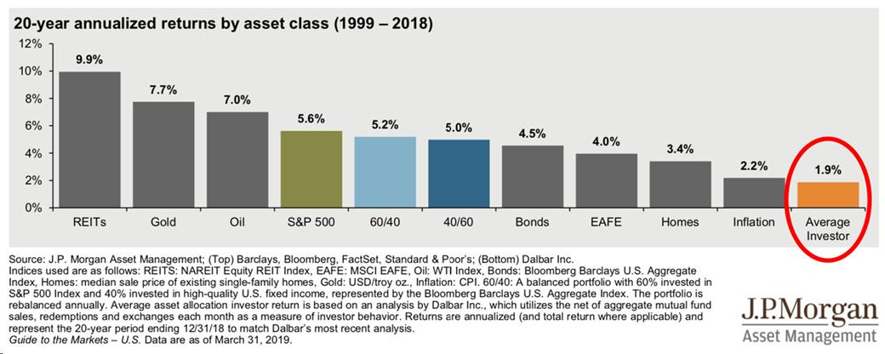
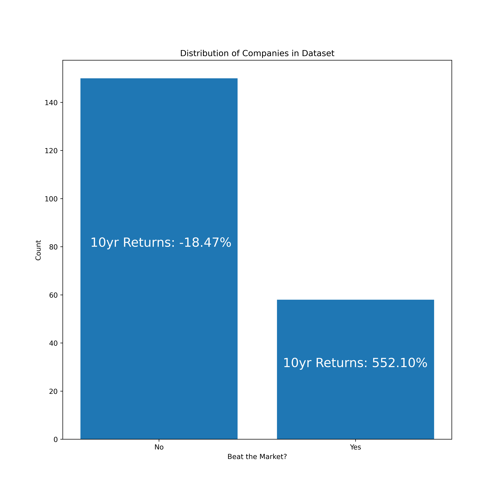
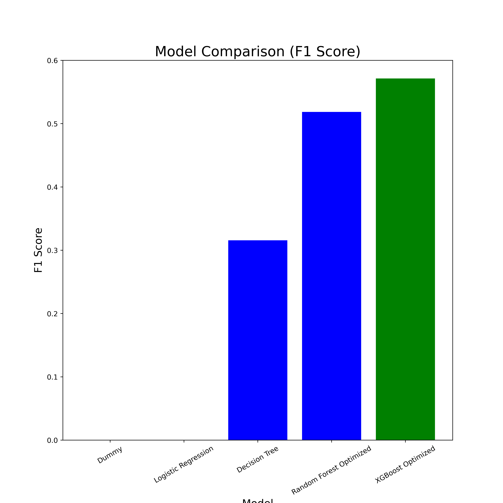
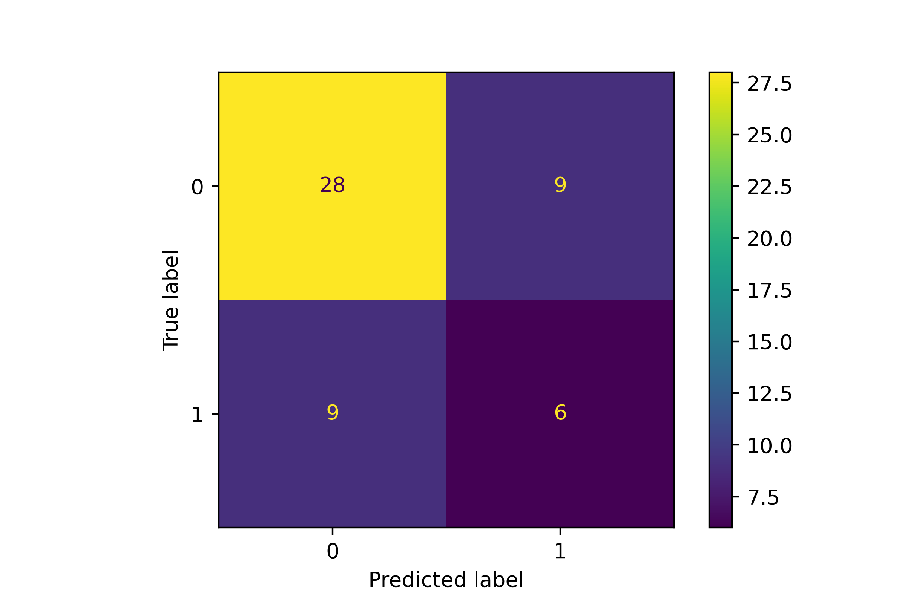

# LongTermStockPerformancePrediction

## Overview and Business Problem

For decades, many humans have attempted to predict the stock market. These attempts have varied in nature from predicting individual stock prices to predicting the direction of the overall market. While most argue that it's impossible to beat the market as an individual investor, I believe that with the right tools and technology, individuals can indeed outperform the market. While I believe this idea is possible, the data shows that individual investors' performances are dreadful on average when compared to the broader market. The bar chart below shows that the average investor had annual returns of 1.9% from 1999-2018 while the S&P500 returned 5.6%.

Currently, to be a well-versed individual investor requires significant time researching companies, listening to earnings calls, and having an understanding of macro-economic trends. Most people do not have the time to become knowledgable on multiple companies that are publicly traded, so it's easier and safer to invest in index funds that track the overall market. But what if there was a tool that could quickly let individual investors know which companies can beat the market over an extended period of time?

## Data Understanding

I have sourced all the required data myself using the SEC's API. I used this API to pull the annual reports (10-K) for public companies from 2009-2012. I could not get any useful data from before 2009 because the SEC didn't require companies to file in XBRL format until then. In the future, I plan to use other methods to acquire and clean data prior to 2009. I stopped collecting data past 2012 because I need a 10 year window to determine if a stock outperformed the market over 10 years based on their financials. 

In terms of metrics that I will use to score the performance of my model, recall will be the most important metric followed by precision. Recall will score how my model does at identifying stocks that do outperform the market. Investors will care more about finding the stocks that can outperform the market rather than correctly identifying those that underperform. Precision will also be a key metric because this gives a score for how accurate our model performs when predicting that a stock does outperform the market. To simplify the metrics I use, I can also use the f1 score as this is the harmonic mean of precision and recall.

As expected, the majority of companies do not beat the market, which can be seen in the distribution of stocks below.

## Modeling
For creating my final model to address this problem, I started with a selection of simpler classification models including Logistic Regression, K Nearest Neighbors, and Decision Tree Classifier. From there, I moved onto more complex options including Random Forest Classifier and XGBoost. I created Random Forest models and XGBoost models both with and without SMOTE performed on the data due to a class imbalance. I found that the models performed much better when I synthetically oversampled the minority class (stocks that beat the market). Below I have shown the f1 scores of a select few models that I tried. As one can see, the optimized XGBoost model peformed best.

### Results

My final XGBoost Classifier model achieved an f1 score on unseen data of 40.0%. While this doesn't sound too impressive, the goal of my model is to find companies that can beat the market over a 10 year period. When creating this model, I did not care about how well the model predicts underperformers. If I bought all 15 companies that my model predicted to beat the market, my overall CAGR for the next 10 years would have been 12.12% which handily outperforms the long term performance of the S&P 500 (~10.5% CAGR). The below plot shows the returns of an individual investor, the S&P 500, and my model. The rates for the first two come from the image at the top of this document. 

The confusion matrix confirms that our model performs equally for both recall and precision. From an accuracy perspective, the model does not appear to do that well. However, stocks that do outperform the market tend to drastically outperform while those that underperform have muted losses. Thus, it is more important to find a few companies that will beat the market because they will offset the losses from the laggards. The confusion matrix can be seen below:

### Limitations

Some limitations that we ran into include:
- Non-Standardized Data: companys' financial documents can use various naming conventions, which makes cleaning the data more cumbersome.
- Time to run models: running multiple GridSearchCV fits can take hours if not days.
- Variety of Filing Formats: the SEC didn't require XBRL data to be filed until 2009, so data prior to this year cannot be accessed in the same manner as data afterwards.

### Next Steps

With more time and resources, here are a few next steps that we would like to pursue for this project:
- Ingest more data: this initial model was built on data from 2009-2012, but there is public market data dating back over 100 years. The first step I will take in improving this model is to intake and clean all available historical data on publicly traded companies. 
- Further tune model: with more time, I could run more grid searches with more hyper parameters included. Some of these grid searches could take multiple days, so I would need significantly more time to optimize the final model.

## Conclusion

In conclusion, using my model will allow newer investors to quickly determine which companies to invest in for the long term. Focusing on the companies that do outperform the market rather than those that underperform will help investors see fruitful gains in their portfolios. 

## For More Information

See the full analysis in the [Data Cleaning Notebook](data_cleaning_notebook.ipynb) and the [Modeling Jupyter Notebook](modeling_notebook.ipynb) or review [this presentation](presentation.pdf).

For additional info, you can reach out to me:

- email:    zacharypollatsek@gmail.com
- cell:     (435)655-5233

## Repository Contents
- data
- images
- working_notebooks
- modeling_notebook.ipynb
- data_cleaning_notebook.ipynb
- .gitignore
- .DS_Store
- README.md
- LICENSE.md
- presentation.pdf
- environment.yml
